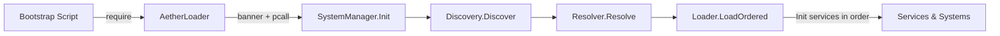

# Architecture

> Scope: how the framework is put together - layout, boot sequence, data flow.
> API reference: [API.md](API.md) - Conventions: [CONVENTIONS.md](CONVENTIONS.md) - Contracts & specs: [SPEC.md](SPEC.md) - Errors & tooling: [DIAGNOSTICS.md](DIAGNOSTICS.md)

## Big picture

AetherSystems is a **module loader + a small set of shared services** for Roblox. It does three things:

1. **Discovery** - finds your systems by convention (folders named `Services/` and `Systems/`), not by a central list.
2. **Resolution** - orders them by their declared dependencies and fails loudly on mistakes.
3. **Initialization** - calls `Init(services)` on each system in that order, injecting the already-initialized services.

On top of the loader sit two built-in services - **Network** (remote transport) and **Motion** (server-driven tweens) - plus shared utilities (**Logger**, **Janitor**, **RaycastUtil**, **NetworkCore**). Everything else is your game code.

The framework lives in three containers:

| Container | Holds | Runs on |
|---|---|---|
| `ServerScriptService/AetherSystems` | loader core, services, systems, config, events | Server |
| `ReplicatedStorage/AetherShared` | shared transport + utilities, remotes, tags | Both |
| `StarterPlayer/StarterPlayerScripts/AetherClient` | client loader, client services, client systems | Client |

## Directory layout

```
ServerScriptService/AetherSystems
|-- Core/
|   |-- Bootstrap (Script)              # boot sequence owner (server)
|   |-- AetherLoader (ModuleScript)     # public API: Get / List / IsReady
|   |   |-- SystemManager               # runs Discovery -> Resolve -> Load
|   |   |-- Discovery                   # finds modules in Services/ and Systems/
|   |   |-- Resolver                    # topological sort + validation
|   |   |-- Loader                      # calls Init(services) in order
|   |   `-- Diagnostics                 # dev tool: logs discovered/resolved graph
|-- Services/
|   |-- Network/
|   |   |-- NetworkServer (ModuleScript)   # server-side Network API
|   |   `-- RateLimit                      # fixed-window rate limiter middleware
|   `-- Motion/
|       |-- TweenDriver (ModuleScript)     # server-side tween API
|       `-- MotionRegistry                 # one active tween per instance
|-- Systems/                           # your actual game features
|   |-- Interaction/Doors/Generic       # reference system (Generic_Door tag)
|   `-- Combat/Turret                   # use case: tests the services together (Turret tag)
|-- Config/
|   `-- NetworkConfig (ModuleScript)    # rate limit settings
`-- Events/                            # runtime BindableEvents (RateLimit.Blocked)

ReplicatedStorage/AetherShared
|-- Event/Network/
|   |-- Event (RemoteEvent)             # fire-and-forget events
|   `-- Function (RemoteFunction)       # invokes
|-- Utils/
|   |-- NetworkCore (ModuleScript)      # shared transport core (server + client)
|   |-- Logger (ModuleScript)
|   |-- Janitor (ModuleScript)
|   `-- RaycastUtil (ModuleScript)      # named cache of reusable RaycastParams
|-- TagList/                            # documented CollectionService tags
`-- Math/                               # reserved (empty)

StarterPlayer/StarterPlayerScripts/AetherClient
|-- Loader/
|   `-- AetherClientLoader (LocalScript)   # client boot sequence
|-- Services/
|   |-- Network/NetworkClient              # client-side Network API
|   `-- Motion/MotionClient                # plays server-initiated tweens
`-- Systems/                               # client game features
```

Developer-only scripts live in `ServerScriptService/Test/` and are **disabled by default**:
`JanitorTest`, `LogHistory`, `NetworkInspector`, `TestInspector`, and the `RaycastUtilTest` regression script (see [DIAGNOSTICS.md](DIAGNOSTICS.md)).

## Component responsibilities

### Server side

- **`Bootstrap`** - a plain `Script` in `Core/`. It waits for `AetherSystems` and requires `Core.AetherLoader`. That single require is what starts the whole boot.
- **`AetherLoader`** - the public module. Requiring it prints the version banner and immediately runs the boot pipeline (inside a `pcall`). Exposes `Get(name)`, `List()`, `IsReady()`. `Get`/`List` block until boot finishes and throw if boot failed.
- **`SystemManager`** - the pipeline owner. `Init()` chains `Discovery.Discover()` -> `Resolver.Resolve(entries)` -> `Loader.LoadOrdered(...)`, then flips the ready flag. Also owns the runtime registry (`_registry`) that `Get`/`List` read.
- **`Discovery`** - scans `AetherSystems.Services` and `AetherSystems.Systems`. For each child folder it finds the *primary module*: the first `ModuleScript` reachable within 3 levels of nesting, using the innermost folder name as the entry name. Bare `ModuleScript`s directly inside `Services/`/`Systems/` are also picked up by their own name. Folders are scanned in sorted order for determinism.
- **`Resolver`** - requires every discovered module (with `pcall`), reads `Descriptor.Name` / `Descriptor.Dependencies`, builds the dependency graph, and runs **Kahn's algorithm** (queue sorted at each step) for a deterministic topological order. Hard errors on: failed require, duplicate name, missing dependency, or a cycle (the remaining in-degree nodes are named in the error).
- **`Loader`** - walks the resolved order and calls `mod.Init(services)`. `services` is a table keyed by registry name containing every successfully initialized module so far; after a successful `Init` the module is added to `services` and to the shared `systemRegistry`. A system whose `Init` throws is warned about and skipped - it never joins the registry, so one bad system doesn't take the rest of the boot down.
- **`Diagnostics`** - standalone dev module that runs `Discovery` + `Resolver` and logs the discovered entries, resolved order, and registry keys. Useful for inspecting the dependency graph without booting the whole game.

### Services

- **`NetworkServer`** (`Descriptor.Name = "Network"`) - registers handlers, fires events/invokes to clients, runs middleware (the rate limiter is installed here in `Init`), and validates every inbound packet. See [API.md](API.md) and [SPEC.md](SPEC.md).
- **`RateLimit`** - a factory that returns a middleware function `(packet, next)`; created with settings from `Config/NetworkConfig`. See [SPEC.md - Rate limiting](SPEC.md#46-rate-limiting).
- **`TweenDriver`** (`Descriptor.Name = "Motion"`, depends on `Network`) - server API for tweens; fires over the network so clients play them, and snaps the server-side instance to the goal afterwards for authority. See [API.md](API.md) and [SPEC.md - Motion protocol](SPEC.md#5-motion-protocol).
- **`MotionRegistry`** - enforces *one active tween per instance* with token-based bookkeeping (`Start`/`IsActive`/`Cancel`) and a `task.delay` completion callback.

### Shared (`AetherShared`)

- **`NetworkCore`** - the transport core used by both `NetworkServer` and `NetworkClient`. Owns the two remotes, event-name validation, the multi-handler/invoke registries (each handler runs under its own `pcall`), and the trace buffer for debugging. It contains no server-only or client-only logic.
- **`Logger`** - fixed-width column logger. See [API.md](API.md).
- **`Janitor`** - cleanup tracker with method inference (`Disconnect` / `Destroy` / explicit name / callable). See [API.md](API.md).
- **`RaycastUtil`** - a named cache of reusable `RaycastParams` (`Register`/`Update`/`Get`/`Remove`/`Exists`). `Get()` always returns the same object, and `Update()` mutates it in place so pre-held references stay in sync - the LOS pattern exercised by the `Turret` use case. See [API.md](API.md).

### Client side

- **`AetherClientLoader`** - the client boot sequence (a `LocalScript`). Scans `AetherClient.Services` and `AetherClient.Systems`, resolves the primary module per folder (folder name -> `<Name>Client` -> `<Name>Server` -> alphabetical fallback), requires everything, **validates dependencies transitively** (a system with a missing/broken dependency is skipped, and so is anything depending on it), topologically sorts (Kahn with a head pointer), calls `Init(services)`, then prints a boot summary listing skipped systems and cycles.
- **`NetworkClient`** - client half of the Network API. Packets arriving before `Init` completes are queued and flushed once ready. `Invoke` is coroutine-based with a 10-second timeout.
- **`MotionClient`** - listens for `Motion.Tween` / `Motion.Property` and plays them via `TweenService`. Tweens are queued until `MotionClient.Ready`.

## Boot sequence

### Server



1. `Bootstrap` (a `Script` in `Core/`) runs and requires `Core.AetherLoader`.
2. Requiring `AetherLoader` prints the version banner, then calls `SystemManager.Init()` inside a `pcall`.
3. `SystemManager.Init()` runs the pipeline: `Discovery.Discover()` collects entries -> `Resolver.Resolve()` produces an ordered name list and registry -> `Loader.LoadOrdered()` requires each module (already required during resolve) and calls `Init(services)` in order.
4. On success the ready flag flips; `AetherLoader.Get(name)`, `AetherLoader.List()`, `AetherLoader.IsReady()` become usable. On failure the boot error is stored, a warning is logged, and `Get`/`List` throw with that error.

> Because boot runs at module-require time, everything happens in the first frame - no `task.wait` needed in normal operation.

### Client

1. `AetherClientLoader` (a `LocalScript` in `AetherClient/Loader/`) runs and scans `AetherClient.Services` and `AetherClient.Systems`.
2. Per folder it resolves the primary module: folder name, then `<Name>Client`, then `<Name>Server`, then the first `ModuleScript` alphabetically.
3. All primary modules are required (under `pcall`). Failures land in the `invalid` table.
4. `validateDependencies` propagates skips transitively: if A depends on X and X is missing or failed, A is skipped too.
5. `topoSort` (Kahn, deterministic) produces the init order and detects cycles; systems stuck with `inDegree > 0` are reported as circular.
6. `Init(services)` is called in order (each under `pcall`); a failed `Init` warns but doesn't halt the rest.
7. A boot summary logs how many systems initialized, plus any skipped/cycled ones.

## Data flow

### A network event, server -> client

```
NetworkServer.Fire(player, "Combat.Hit", data)
  -> Core.ValidateEventName
  -> Core.Remote:FireClient(player, "Combat.Hit", data)
  -> NetworkClient (Remote.OnClientEvent)
    -> validate eventName
    -> if not ready: queue -> else: _dispatch("Combat.Hit", data)
```

### A network event, client -> server

```
NetworkClient.FireServer("Combat.Attack", data)
  -> Core.Remote:FireServer("Combat.Attack", data)
  -> NetworkServer (Remote.OnServerEvent)
    -> validate eventName -> build packet { player, eventName, args }
    -> runMiddleware(packet, next)     # rate limiter runs here
      -> _dispatch(eventName, player, ...)
```

### A tween, server -> client

```
TweenDriver.Move(instance, { Goal, Duration, ... })
  -> MotionRegistry.Start (one-tween-per-instance token)
  -> Network.FireAll("Motion.Tween", instance, goal, duration, easingData)
  -> MotionClient.onTween -> applyMove (CFrameValue proxy + Janitor) -> TweenService
  -> server snaps instance to goal when the registry timer completes
```

## Dependency resolution rules (recap)

| Condition | Server | Client |
|---|---|---|
| Missing dependency | hard error at boot (names the system + dependency) | system skipped, reported in boot summary |
| Circular dependency | hard error at boot (lists remaining nodes) | affected systems skipped, reported as circular |
| Duplicate registry name | hard error at boot | warning, later one ignored |
| Failed `require` | hard error at boot | skipped, reason recorded |
| Failed `Init` | warned + skipped (not registered) | warned + skipped |
| No `Init` function | registered, never initialized | loaded, logged as `[no Init]` |

## Design notes

- **Fail loud, fail early** on the server; **skip + report** on the client. A misconfigured server must not half-boot silently; a client with a broken optional system shouldn't prevent the player's experience from starting.
- **Convention over configuration.** There is no central list of systems to maintain - drop a folder in `Services/` or `Systems/` and it is discovered.
- **The registry is the source of truth.** Systems refer to each other by registry name (`Descriptor.Name` or folder name) everywhere - in `Dependencies`, in `services.X`, and in `AetherLoader.Get("X")`.
- **Everything public goes through the Loader.** `AetherLoader` is the only module outside `Core/` that should be required; internal modules (`SystemManager`, etc.) are implementation details.
